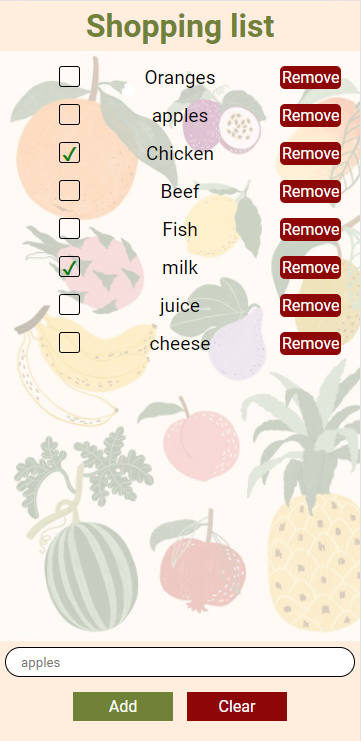

# Shopping list - Web App

## Description
---
Simple shopping list app.

Frontend: HTML, CSS, Vanilla JavaScript

Backend: PHP, MySQL, Apache

To get shopping list items from database I used HTTP Long-Polling, implemented with Ajax.